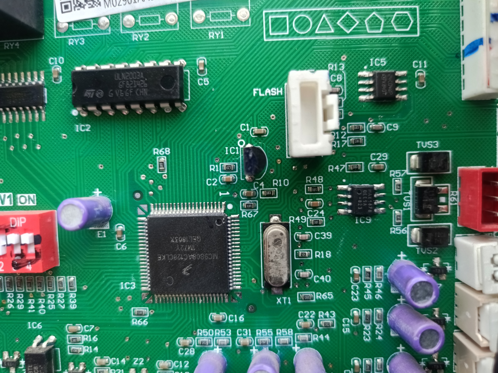
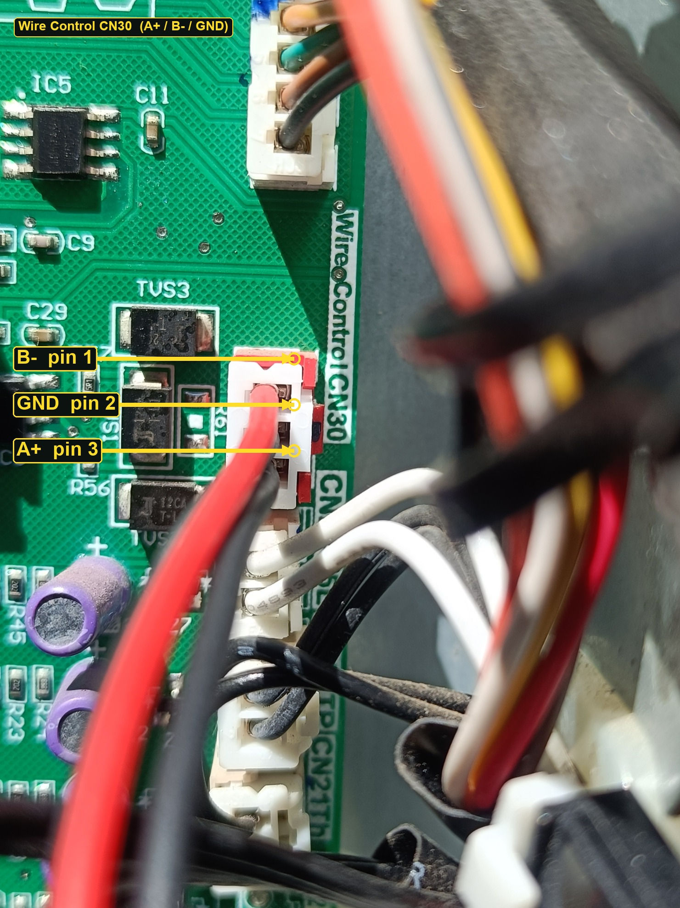

# Midea 170L Heat Pump Water Heater via CN30

Read-only Home Assistant integration and RS-485 research for a **Chromagen / Midea HP170** (170 L, model **RSJ-15/190RDN3-C**) whose main board is silk **R-ZT15/190(C)-A[AC128]**.

Status is taken from the red 3-pin **Wire Control CN30** header: a custom **600 baud 8N1** 33-byte broadcast, not Modbus.

| | |
|---|---|
| Home Assistant integration | [`custom_components/midea_cn30_hws`](custom_components/midea_cn30_hws/) (read-only) |
| Protocol + sniff tools | [`verify/`](verify/) |
| Board photos and pinout | [`docs/`](docs/) |
| Lovelace panel card | [`www/midea-w-heater-panel.js`](www/midea-w-heater-panel.js) |

This project is **not** [0xAHA/Midea-Heat-Pump-HA](https://github.com/0xAHA/Midea-Heat-Pump-HA). That community integration talks **9600 8N1 Modbus** to a different main board. On this PCB that profile times out. Do not install it against the CN30 EW-11 dongle.

---

## 1. Proving the header is real RS-485

The journey started on the main controller with the cover off, identifying the parts that make CN30 a genuine RS-485 wire-control port.

### MCU

**IC3** is a Freescale **MC9S08AC128CLKE** (silk `MC9S08AC128CLKE`). That is the tank controller. There is no rotary S3 on this board. M-Thermal hydronic notes (H:0–H:6, CN14, FC06/FC16) do not apply.



### RS-485 PHY and protection

Beside the red header:

- **IC9** is a **MAX14780EESA+** RS-485 transceiver (the CN30 PHY).
- **TUS1 / TUS2 / TUS3** are TVS protection diodes on the data pair.
- Silk **`WireControl CN30`** is printed next to the 3-pin housing.

Those parts are why this is treated as RS-485 A/B + GND, not a TTL UART or a 12 V ribbon.

### Red CN30 3-pin (A+, B−, GND)

Looking at the white 3-pin housing with the red latch on the right:

| Pin (top → bottom) | Function |
|---|---|
| 1 (upper gold contact) | **B−** |
| 2 (middle) | **GND** |
| 3 (lower) | **A+** |



Connect **data pair + GND only**. Do not put heater VCC or ribbon power on A or B. Power an Elfin EW-11 from a separate 5–18 V supply, and tie its GND to heater bus GND.

On the EW-11 used here, the A/B pair at the **dongle screw labels** is swapped relative to this header. Leave that swap; the bus already works.

---

## 2. Reading status: EW-11 Wi-Fi, USB-UART, Kali, Grok Build

Two listen paths were used. Both are **receive-only** for day-to-day work.

```
Heater CN30 (600 8N1 RS-485)
        │
        ├─ Elfin EW-11A  ──Wi-Fi──► TCP 192.168.31.219:502 (transparent, UART proto NONE)
        │
        └─ TTL-RS485 ──USB-UART──► Kali (/dev/ttyUSB0) ──Wi-Fi──► Windows PC
                                      Grok Build TUI drives the Kali tools over SSH
```

### EW-11A (live bridge)

- Hostname `WaterHeater.lan` → `192.168.31.219`
- UART **600,8,1,NONE**, FlowCtrl **2** (half-duplex RS-485), GapTime **1000**
- Socket `netp`: TCP server **port 502**, raw serial tunnel
- One TCP client at a time. A second client on `:502` swallows UART.

Sniff from Windows or Kali:

```powershell
python verify/cn30_sniff.py --seconds 20
```

### Kali USB-UART path

The USB-RS485 adapter lives on Kali (`/dev/ttyUSB0`), not on the Windows PC. Grok Build’s TUI on Windows SSHs to that host and runs `verify/` there. When Kali sleeps, port 22 and the serial bridge go away — wake it before a listen.

### What a live frame looks like

Canonical frames are **33 bytes**, about every 4 s:

- Header `FE AA 00 00 FF`
- Terminator `55`
- Checksum at index 31: `(168 - sum(bytes 0..30)) & 0xFF`

Owner sensor names vs bytes (scale for T5/T3/T4 is `(raw * 0.5) - 15`):

| Panel | Byte | Notes |
|---|---|---|
| T5 / T5L tank | 16 (byte 23 copies it) | Large LCD number |
| T3 evaporator | 15 | |
| T4 ambient | 24 | |
| TP discharge air | 22 | Unscaled integer °C |
| EEV | 20 | Integer; idle frames sit at 60 |
| Setpoint | 29 | Integer °C |
| Mode pair | 5–6 | Eco `01 01`, Hybrid `02 02`, Off `04 04`, E-Heater `0C 08` / `14 14` |
| Timer | bit `0x10` on byte 5 or 6 | |
| Element glyph | 21 | Can be set while mode is Off |

TH suction has no separate byte in this 33-byte frame.

Local decode UI (read-only, stop it before Home Assistant owns port 502):

```powershell
pip install -r verify/requirements.txt
python verify/web_app.py
# http://127.0.0.1:8765/
```

---

## 3. Home Assistant custom integration

### Why the community integration does not fit

[0xAHA/Midea-Heat-Pump-HA](https://github.com/0xAHA/Midea-Heat-Pump-HA) expects:

- a **different** main board
- **Modbus RTU/TCP**, 9600 8N1, slave 1
- holding registers for power / mode / setpoint

This HP170 board has **no Modbus slave** on CN30. The EW-11 port 502 is a **transparent UART tunnel**, not a Modbus gateway. Installing that HACS integration on this dongle will sit in timeout and can steal the only TCP client slot.

Use **`midea_cn30_hws`** instead.

### Install

1. Copy the folder into Home Assistant:

   `config/custom_components/midea_cn30_hws/`

   (this repo path: [`custom_components/midea_cn30_hws`](custom_components/midea_cn30_hws/))

2. Stop any other client on EW-11 TCP **502** (`verify/web_app.py`, a sniffer, a second HA process).
3. **Restart Home Assistant** (a config-entry reload is not enough the first time).
4. Settings → Devices & services → Add integration → **Midea Water Heat Pump (CN30)**.
5. Host `192.168.31.219`, port `502`. Setup waits for one checksum-valid `FE AA` frame and **does not transmit**.

Optional Lovelace card: copy [`www/midea-w-heater-panel.js`](www/midea-w-heater-panel.js) to `config/www/` and add a module resource `/local/midea-w-heater-panel.js`.

### What you get

Read-only `water_heater` plus T5L, T3, T4, TP, EEV, element, timer. `set_temperature` / `set_operation_mode` raise an error and never touch the socket.

More detail: [`custom_components/midea_cn30_hws/README.md`](custom_components/midea_cn30_hws/README.md).

---

## 4. WRITE commands: still unsolved

The built-in keypad is a **local matrix**. Presses do not emit serial key codes on CN30. The heater **masters** the bus and broadcasts status. Copies of that broadcast are not commands.

### What did light icon ② (Wire Controller)

The fascia “Wire Controller” glyph is **Fig. 6-2 icon ②**, a reserved function in the manual: it lights when a wire controller is connected.


The only TX that has been observed to light that glyph is a **finished 33-byte status copy** injected on CN30 while the unit was Off (`04 04`). UART SentFrames/SendBytes rose. The same class of copy **also latched keypad E2** (tank / wired-controller communication). It did **not** move setpoint byte 29 or the mode pair.

That is a presence/monitor glyph, not a proven write.

### What failed

Closed. Do not rerun opcode sprays or brute-force walkers on a live tank.

| Attempt | Result |
|---|---|
| Patched 33-byte clones (`patch_frame`, setpoint nudge) | Ignored; setpoint stayed |
| Exact 33-byte copy while Off | Glyph ②; **E2** |
| Exact copy while Economy running | No setpoint/mode change |
| Short `FE AA … 55` keypad-shaped frames | No accepted command |
| One-byte and two-byte opcode walks (`cn30_brute.py`) | Mode and byte 29 unchanged; walk stopped |
| Key-number campaigns (`cn30_key_campaign.py`) | No hit |
| Modbus RTU FC06/FC16 at 600–19200 | D30 never became the value sent |
| XYE / `AA C0` shaped probes | No echo |

Acceptance rule used throughout: the **next heater status frame** must move byte 29 by 1 °C or step the mode pair. A buzzer beep is not a pass (the buzzer is on the display board; E2 also beeps). After a mains cycle the unit cold-boots into E-Heater (`0C 08`); that is not a write we sent.

**Do not send a 33-byte copy while Off `04 04`.** That path latched E2.

The missing piece is a capture of a **real Midea/Chromagen Wire Monitor / wired controller** talking on CN30: the command frames it sends in the quiet gap between status broadcasts. Until that exists, Home Assistant stays read-only.

See the open GitHub issue on this repository: **CN30 WRITE protocol unknown**.

---

## Safety

- 240 VAC inside the HWS cover is **licensed-electrician only**.
- Do not opcode-spray while the element can run.
- Clear E2 without cycling mains: hold CANCEL until the padlock goes out, then TIME ON + CANCEL together.

## License

MIT. Hardware photos are of a privately owned HP170 for documentation of this board.
