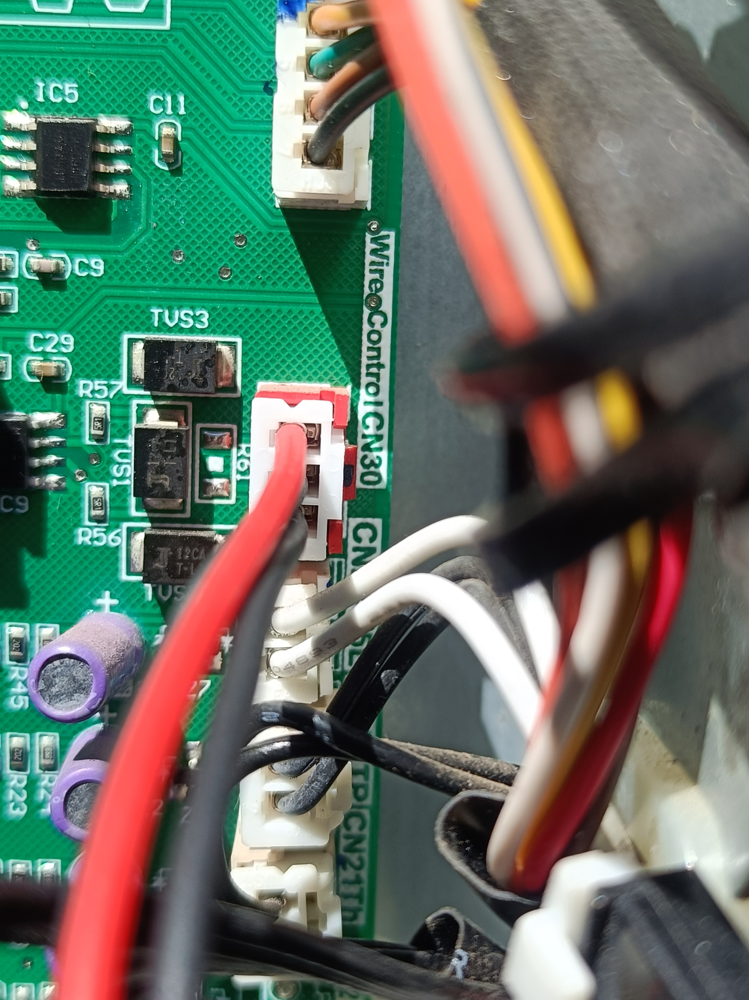
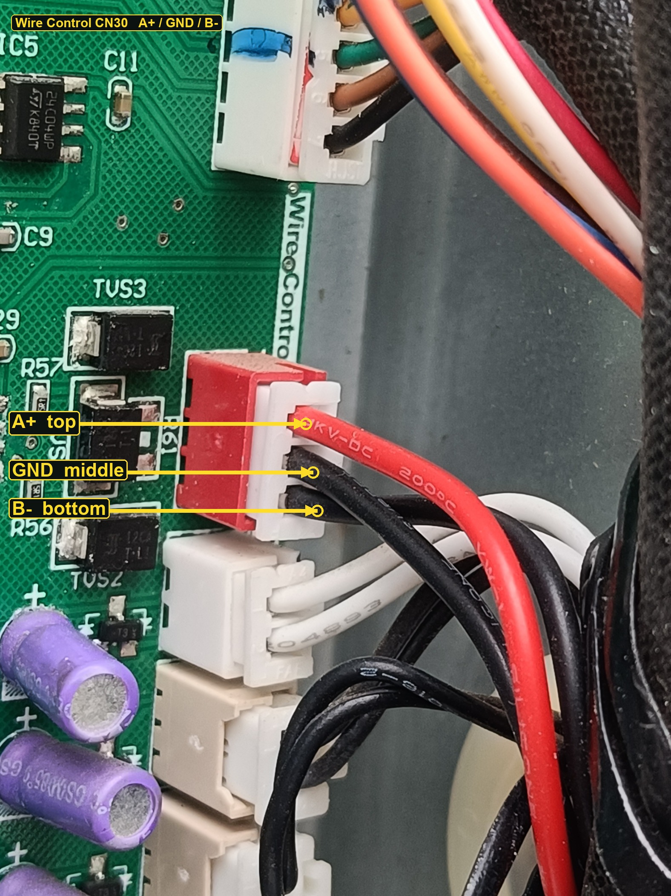
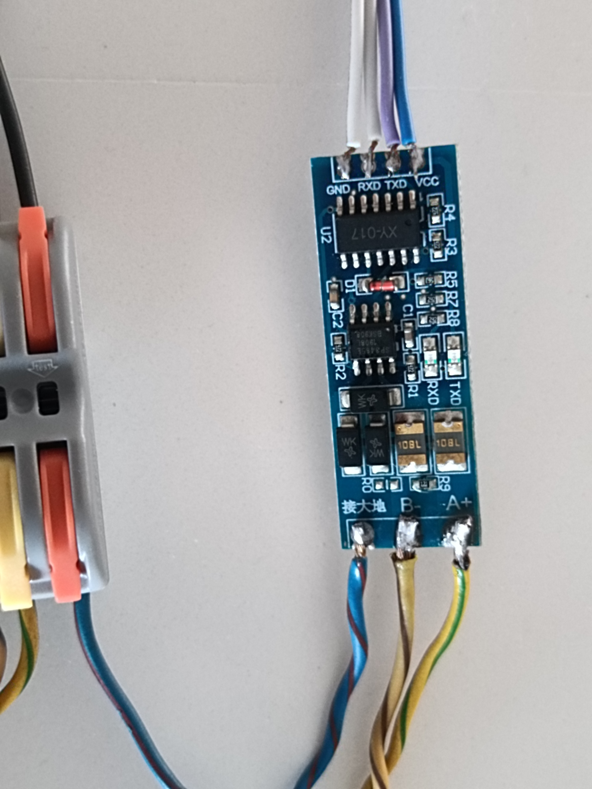
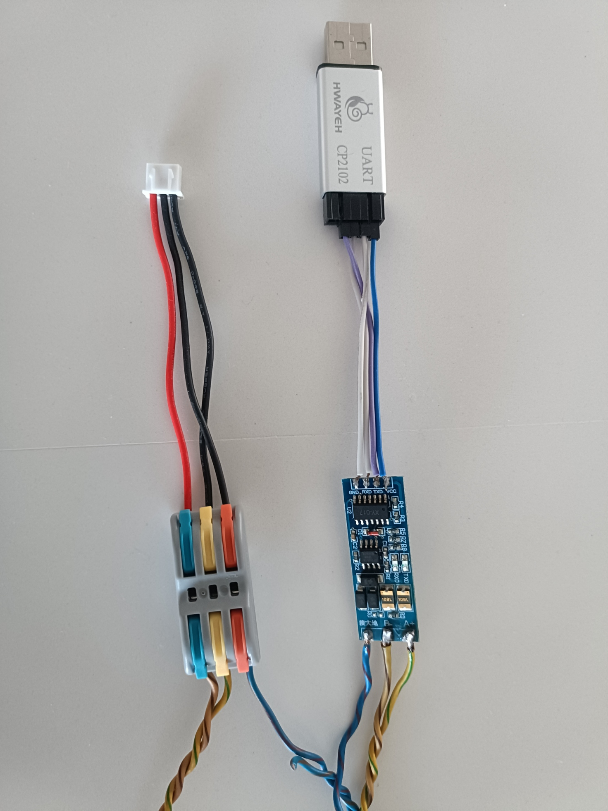

# Midea 170L Heat Pump Water Heater via CN30

Read-only **Home Assistant** integration and RS-485 research for a Chromagen / Midea **HP170** (170 L).

| | |
|---|---|
| Unit | **RSJ-15/190RDN3-C** · tank 170 L · 220–240 V 50 Hz |
| Main board | Silk **R-ZT15/190(C)-A[AC128]** · MCU **MC9S08AC128CLKE** |
| Bus | Red 3-pin **Wire Control CN30** · **600 baud 8N1** 33-byte broadcast · **not Modbus** |
| Bridge | Elfin **EW-11A** transparent TCP (UART proto **NONE**) |
| Software | Written **100% with [Grok Build](https://grok.com)** (xAI) |

This is **not** [0xAHA/Midea-Heat-Pump-HA](https://github.com/0xAHA/Midea-Heat-Pump-HA). That community integration talks **9600 8N1 Modbus** to a **different** main board. On this PCB it times out. Do not install it on the CN30 EW-11 dongle.

**Ongoing discussion:** [GitHub Issues](https://github.com/ThierryBrunet/midea-170l-heat-pump-water-heater-cn30/issues) — start at **[#1 CN30 WRITE protocol unknown](https://github.com/ThierryBrunet/midea-170l-heat-pump-water-heater-cn30/issues/1)**.

---

## The unit


*Filename: `Midea WH specs.jpg` — rating plate. Model RSJ-15/190RDN3-C, 170 L, R134a, max outlet 70 °C.*


*Filename: `Midea WH specs - Chromagen Australia Service.jpg` — same plate plus Chromagen service contact.*


*Filename: `MIDEA Keypad_Display-7 years under harsh sun.jpg` — the local keypad still works; CN30 is the spare wire-control path.*

---

## 1. Proving CN30 is real RS-485

The cover came off so the ICs next to the red header could be identified.


*Filename: `MCU-MAX285-CNN30.jpg` — **IC3** Freescale **MC9S08AC128CLKE** (tank MCU). **IC9** beside CN30 is a **MAX14780EESA+** RS-485 transceiver (not a MAX285). **TUS1 / TUS2 / TUS3** are TVS diodes on the data pair. Silk **WireControl CN30** is on the board edge.*



*Filename: `cn30-pinout.jpg` — red 3-pin **Wire Control CN30** (gold contacts, red latch).*

### Pinout (A+ top, GND middle, B− bottom)



*Filename: `cn30-pinout-2-annotated.jpg` — looking at the white housing, wires leaving to the right.*

| Pin | Wire in the photo | Function |
|---|---|---|
| 1 top | red | **A+** |
| 2 middle | black | **GND** |
| 3 bottom | black | **B−** |

Connect **data pair + GND only**. Do not put heater VCC or ribbon power on A or B.

---

## 2. Powering the EW-11 (separate 12 V, not the heater 3-pin)

The EW-11 takes **5–18 V DC** from its own PSU. Tie **EW-11 GND** to **heater bus GND**. 240 VAC pickup inside the HWS cover is **licensed-electrician only**.

.jpg)

*Filename: `240VAC pickup for 12VDC (white wires at top).jpg` — white 240 V leads at the top of the open cabinet feed the small 12 V module. Do not land that voltage on CN30 A/B.*


*Filename: `Positionning EW11 and 12V supply.jpg` — EW-11 and AM11-12W12C 12 V PSU on the cabinet wall, keypad still on the unit.*


*Filename: `EW11 and 12VDC.jpg` — Elfin EW-11 under the AM11-12W12C (100–250 VAC in, 12 V 1 A out). Red = V+, black = V− on the dongle. Ethernet is the LAN link, not RS-485.*

---

## 3. CN30 → EW-11 wiring


*Filename: `EW11 green connector.jpg` — EW-11 on the left of the open chassis; green 4-pin plug is the RS-485 / power header.*


*Filename: `EW11 green connector wiring.jpg` — close-up of the green plug. On this install the A/B pair at the **dongle screw labels** is swapped versus the CN30 header; **leave that swap**. Data pair + GND only.*


*Filename: `A-B-Ground splicing.jpg` — heat-shrink splices from the CN30 pair into the EW-11 tails (A+, B−, GND).*


*Filename: `CN30 to EW11 wiring top view.jpg` — board silk **R-ZT15/190(C)-A[AC128]**, CN30 on the right edge, EW-11 RS-485 brick on the cabinet lip, green plug below.*

### EW-11 UART (required)

| Setting | Value |
|---|---|
| Baud | **600**, 8N1, parity NONE |
| Flow control | half-duplex RS-485 (**FlowCtrl 2**) |
| UART protocol | **NONE** (Modbus mode splits these frames) |
| GapTime | **1000** |
| Socket `netp` | TCP **server**, port **502**, transparent |

One TCP client at a time. A second client on `:502` swallows UART.

---

## 4. Research path: USB-UART + TTL-RS485 (Kali)

Before the EW-11 stayed on the tank, READ was proven with a cheap TTL-RS485 module and a CP2102, driven from **Kali** (`/dev/ttyUSB0`). **Grok Build** on a Windows PC SSHed to Kali and ran `verify/`.

.jpg)

*Filename: `RS485 module (AliExpress).jpg` — “TTL Turn To RS485” module (A+ / B− / 接地).*



*Filename: `RS485-TTL.jpg` — same module wired: TTL GND/RXD/TXD/VCC and RS-485 A+/B−/GND. RX/TX on the TTL side had to be crossed versus silk.*



*Filename: `RS485-TTL-CN30.jpg` — CP2102 USB-UART, TTL-RS485 module, Wago, and a 3-pin lead that mates CN30 (red / two blacks).*

Do not run this USB adapter and the EW-11 on CN30 at the same time.

---

## 5. What a live frame looks like

Canonical frames are **33 bytes**, about every 4 s:

- Header `FE AA 00 00 FF`
- Terminator `55`
- Checksum at index 31: `(168 - sum(bytes 0..30)) & 0xFF`

| Panel | Byte | Notes |
|---|---|---|
| T5 / T5L tank | 16 (byte 23 copies it) | Large LCD number. Scale `(raw * 0.5) - 15` |
| T3 evaporator | 15 | Same scale |
| T4 ambient | 24 | Same scale |
| TP discharge air | 22 | Unscaled integer °C |
| EEV | 20 | Integer |
| Setpoint | 29 | Integer °C |
| Mode pair | 5–6 | Eco `01 01`, Hybrid `02 02`, Off `04 04`, E-Heater `0C 08` / `14 14` |
| Timer | bit `0x10` on byte 5 or 6 | |
| Element glyph | 21 | Can be set while mode is Off |

TH suction has no separate byte in this 33-byte frame.

Local decode UI (stop it before Home Assistant owns port 502):

```powershell
pip install -r verify/requirements.txt
python verify/cn30_sniff.py --seconds 20
python verify/web_app.py
# http://127.0.0.1:8765/
```

---

## 6. Replicate the full Home Assistant integration


*Filename: `HA WaterHeater Dasboard.png` — sidebar dashboard **Midea W-Heater**. Large LCD is T5, SET is the setpoint. Keys are display-only and do not send commands. Chart is 3 days with local tariff bands.*

### Hardware (once)

1. Identify **Wire Control CN30** (red 3-pin). Pinout above: **A+ / GND / B−**.
2. Licensed electrician: 240 VAC pickup → isolated **12 V** PSU for the EW-11 only.
3. Splice CN30 A+, B−, GND to the EW-11 RS-485 pair + GND. Do not feed heater VCC into A/B.
4. Configure the EW-11: **600 8N1**, UART proto **NONE**, half-duplex, TCP **502**.
5. Confirm READ: `python verify/cn30_sniff.py --seconds 20` should print checksum-OK `FE AA` frames.

### Software

1. Copy this repo folder into Home Assistant:

   ```
   config/custom_components/midea_cn30_hws/
   ```

   Source: [`custom_components/midea_cn30_hws`](custom_components/midea_cn30_hws/).

2. Copy the Lovelace card:

   ```
   config/www/midea-w-heater-panel.js
   ```

   Source: [`www/midea-w-heater-panel.js`](www/midea-w-heater-panel.js).

3. **Stop** every other TCP client on EW-11 port **502** (`verify/web_app.py`, a sniffer, a second integration).
4. **Restart Home Assistant** (a config-entry reload is not enough the first time a custom component is added).
5. Settings → Dashboards → Resources → add module:

   `/local/midea-w-heater-panel.js?v=8`

6. Settings → Devices & services → Add integration → **Midea Water Heat Pump (CN30)**.
7. Host of the EW-11 (example `192.168.31.219`), port **502**. Setup waits for one checksum-valid frame and **does not transmit**.
8. Create a storage dashboard `url_path` **`midea-w-heater`**, panel view, card `custom:midea-w-heater-panel`, bound to the live `water_heater.chromagen_hp170` entity and the T5L / T4 / T3 / TP / EEV sensors. Hard-refresh the browser after a resource bump.

The water heater entity is **read-only**. `set_temperature` / `set_operation_mode` raise an error and never touch the socket.

More entity detail: [`custom_components/midea_cn30_hws/README.md`](custom_components/midea_cn30_hws/README.md).

---

## 7. WRITE: only glyph ② has been lit

The built-in keypad is a **local matrix**. Presses do not emit serial key codes on CN30. The heater **masters** the bus and broadcasts status. Copies of that broadcast are not setpoint/mode commands.


*Filename: `Wire Controller Display Glyph.png` — manual Fig. 6-2 icon **② WIRE CONTROLLER** (reserved function).*

**The only successful WRITE observed** is a finished **33-byte status copy** (`FE AA … 55`) injected while Off (`04 04`). That frame **lit icon ②**. It also **latched keypad E2**. It did **not** move setpoint byte 29 or the mode pair. UART SentFrames went up; that is not command acceptance.

Do **not** send a 33-byte copy while Off `04 04`.

Closed without a hit (do not rerun on a live tank): patched clones, keypad-shaped shorts, 1-byte and 2-byte opcode walks, Modbus FC06/FC16 at 600–19200, XYE probes.

Acceptance is the **next heater status frame** moving byte 29 or bytes 5–6. A beep is not a pass.

Hopefully someone who can sniff a **real Wire Monitor** on this header will crack the remaining WRITE frames.

**Discussion is on GitHub Issues:**

- https://github.com/ThierryBrunet/midea-170l-heat-pump-water-heater-cn30/issues
- https://github.com/ThierryBrunet/midea-170l-heat-pump-water-heater-cn30/issues/1

---

## Developed with Grok Build

All integration code, the Lovelace panel, the CN30 decoder, the Kali/Windows verify tools, and this documentation were developed **100% with Grok Build** (xAI).

---

## Safety

- 240 VAC inside the HWS cover is **licensed-electrician only**.
- Do not opcode-spray while the element can run.
- Clear E2 without cycling mains: hold CANCEL until the padlock goes out, then TIME ON + CANCEL together.

Manual: [`docs/Manual_Book_170L_Heat_pump_water_heater.pdf`](docs/Manual_Book_170L_Heat_pump_water_heater.pdf). Extra hardware notes: [`docs/hardware-midea-ew11.md`](docs/hardware-midea-ew11.md).

## License

MIT. Hardware photos are of a privately owned HP170, for documenting this board.
